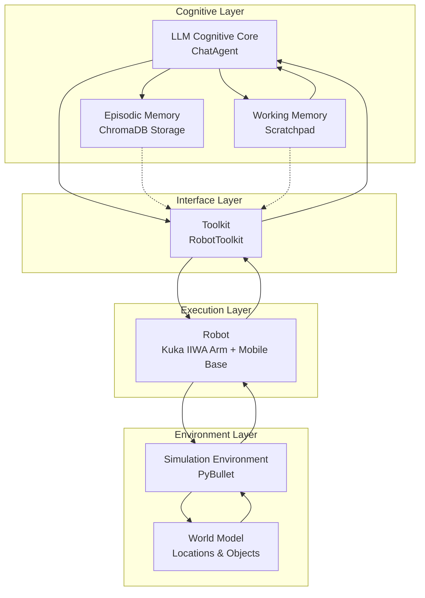
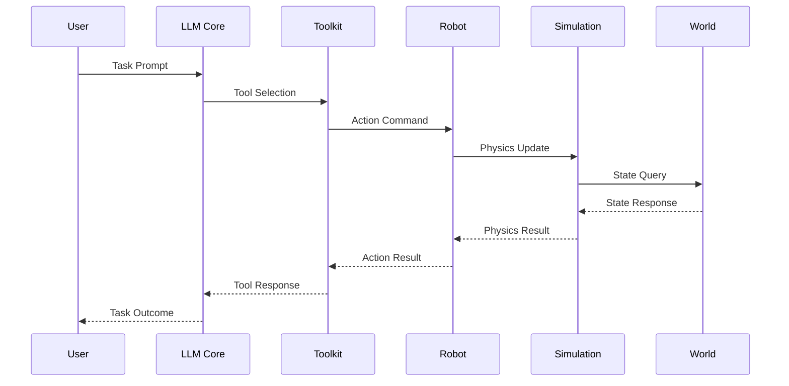
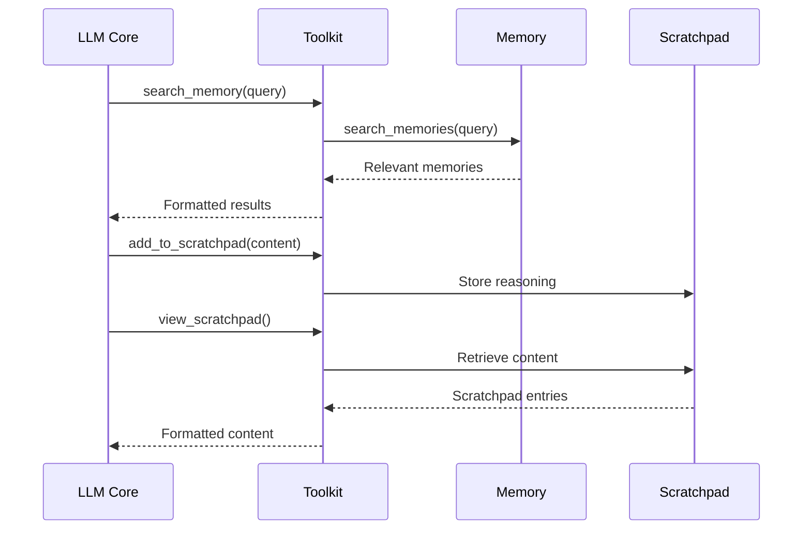
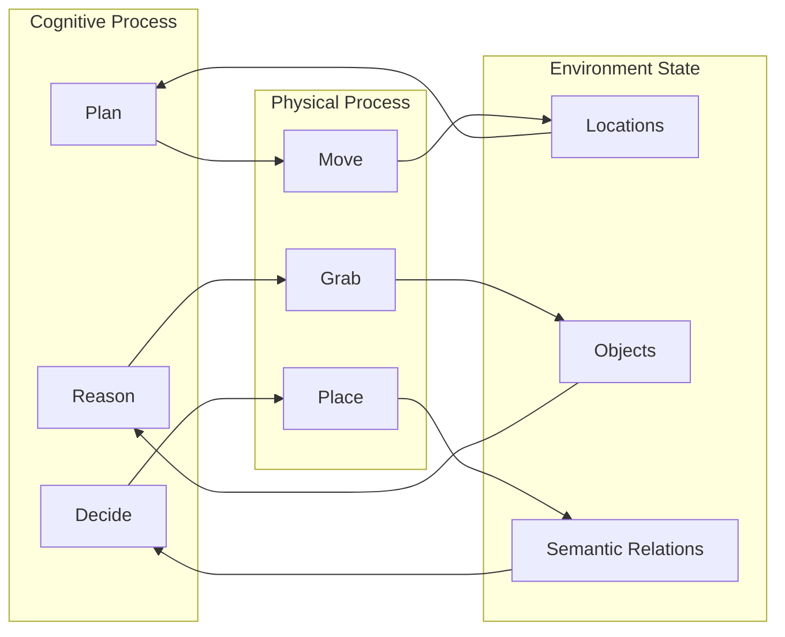

# CogRob Architecture Documentation

## System Overview

CogRob (Cognitive Robotics) is a framework that integrates Large Language Models (LLMs) with robotic control systems in a PyBullet simulation environment. The architecture enables cognitive capabilities like memory, reasoning, and tool usage for robotic task execution.

## Core Architecture Components



## Component Details

### 1. LLM Cognitive Core (`ChatAgent`)
- **Purpose**: Central reasoning and decision-making component
- **Implementation**: [`camel.agents.ChatAgent`](robot.py:93)
- **Capabilities**:
  - Processes natural language task prompts
  - Selects appropriate tools from toolkit
  - Reasons about task execution using scratchpad
  - Accesses episodic memory for past experiences

### 2. Episodic Memory (`Memory`)
- **Purpose**: Persistent storage and retrieval of past experiences
- **Implementation**: [`memory.Memory`](memory.py:11)
- **Storage**: ChromaDB vector database
- **Operations**:
  - [`add_memory()`](memory.py:32) - Store task outcomes
  - [`search_memories()`](memory.py:55) - Semantic search of past tasks
  - [`get_memory_by_id()`](memory.py:85) - Retrieve specific memories

### 3. Working Memory (Scratchpad)
- **Purpose**: Temporary storage for reasoning and planning
- **Implementation**: [`RobotToolkit.scratchpad`](toolkit.py:26)
- **Operations**:
  - [`add_to_scratchpad()`](toolkit.py:191) - Add reasoning entries
  - [`view_scratchpad()`](toolkit.py:208) - Review planning thoughts

### 4. Toolkit (`RobotToolkit`)
- **Purpose**: Bridge between cognitive layer and execution layer
- **Implementation**: [`toolkit.RobotToolkit`](toolkit.py:14)
- **Available Tools**:
  - **Perception**: [`look_around()`](toolkit.py:49) - Environment observation
  - **Navigation**: [`move_to()`](toolkit.py:68) - Path planning and movement
  - **Manipulation**: 
    - [`grab()`](toolkit.py:81) - Object grasping
    - [`place()`](toolkit.py:96) - Object placement
  - **Memory**: [`search_memory()`](toolkit.py:149) - Past experience retrieval
  - **Task Management**: [`end_task()`](toolkit.py:112) - Task completion reporting

### 5. Robot (`Robot`)
- **Purpose**: Physical embodiment and actuator system
- **Implementation**: [`robot.Robot`](robot.py:19)
- **Components**:
  - Mobile base with collision physics
  - Kuka IIWA robotic arm (7-DOF)
  - Gripper end-effector
- **Capabilities**:
  - [`move_to()`](robot.py:210) - Autonomous navigation
  - [`grab()`](robot.py:331) - Object manipulation
  - [`place()`](robot.py:493) - Precise object placement

### 6. Simulation Environment (`SimulationEnvironment`)
- **Purpose**: Physics simulation and world management
- **Implementation**: [`simulation.SimulationEnvironment`](simulation.py:37)
- **Features**:
  - PyBullet physics engine integration
  - Real-time or accelerated simulation
  - Subscriber pattern for component updates

### 7. World Model (`World`)
- **Purpose**: Semantic representation of environment
- **Implementation**: [`world.World`](world.py:57)
- **Components**:
  - **Locations**: Semantic areas with coordinates and relationships
  - **Objects**: Physical entities with properties and positions
  - **Path Planning**: A* algorithm for navigation
- **Operations**:
  - [`get_path_between()`](world.py:125) - Navigation planning
  - [`get_locations_description()`](world.py:166) - Environment state reporting

## Communication Patterns

### 1. Task Execution Flow


### 2. Memory Access Pattern


### 3. Environment Interaction


## Data Structures

### Memory Entry Format
```yaml
memory:
  id: uuid
  content: "Task description"
  metadata:
    status: "success/failure/unknown"
    summary: "Execution trace details"
```

### World Location Structure
```yaml
location:
  name: "Kitchen Shelf"
  center: [x, y, z]
  place_positions:
    top: [x, y, z]
    middle: [x, y, z]
    bottom: [x, y, z]
  neighbours: ["Kitchen Table", "Kitchen Door"]
  occupied_by: "object_name/null"
```

### Tool Call Format
```yaml
tool_call:
  function: "move_to/grab/place/etc."
  parameters: {...}
  result:
    status: "success/failure/timeout"
    message: "Detailed outcome"
```

## Configuration

The system is configured via [`config.yaml`](config.yaml) with parameters for:
- Simulation timing (`time_step`, `real_time`)
- Experimental setup (`num_trials`, `num_memory_trials`)
- Model selection (multiple LLM options)
- Task prompts and evaluation conditions

## Key Design Patterns

1. **Toolkit Pattern**: LLM accesses environment through well-defined tools
2. **Memory Augmentation**: Episodic memory enhances LLM capabilities
3. **Scratchpad Reasoning**: Working memory for step-by-step planning
4. **Subscriber Pattern**: Simulation environment notifies components of state changes
5. **Semantic World Model**: Abstract representation of physical environment

This architecture enables cognitive robotics capabilities where LLMs can reason about tasks, learn from experience, and execute physical actions in a simulated environment.